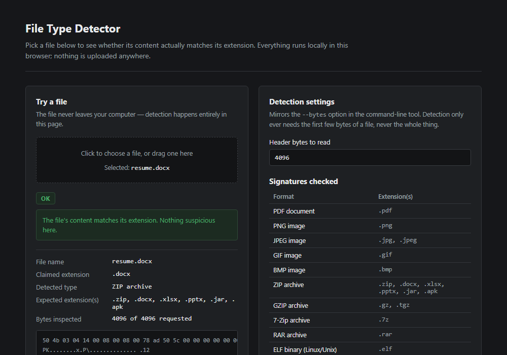
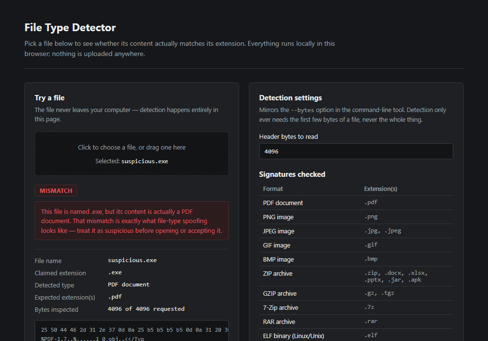

# File Type Detector

A small tool that checks what a file actually is, instead of trusting its name.

Most systems decide how to treat a file based on its extension — `.pdf`, `.docx`,
`.exe`, and so on. That's just a label someone typed, and it's trivial to change.
This tool looks at the first few bytes of a file instead, where most file formats
leave a fixed signature (often called "magic bytes"), and compares that against
the extension. If they don't match, it tells you.

It won't catch every threat — a well-crafted malicious PDF is still a PDF — but it
catches the common trick of renaming an executable, script, or archive so it looks
like something harmless.

## Try it without installing anything

Open [`demo/index.html`](demo/index.html) in any browser (double-click the file,
no server or install required). Drop a file onto it and it'll tell you what the
file actually is versus what its extension claims. Everything happens in your
browser — the file is never uploaded anywhere.

**A normal file — extension matches content:**



**A renamed file — extension does not match content:**



The demo page checks the same signatures as the command-line tool below, it's
just a browser-friendly way to show what the tool does before installing it.

## Why this matters

Extension checks alone are not a safe way to validate uploaded files. Someone can
save `payload.exe` as `invoice.pdf` and most naive upload forms will happily
accept it. Looking at the actual file content is a cheap, fast first check that
catches this class of spoofing before the file is opened or processed further.

This project exists to demonstrate that idea clearly and to be genuinely useful as
a quick scanner for a folder of files — downloads, email attachments, shared
drives — you want to sanity-check.

## What it detects

| Format | Extensions |
|---|---|
| PDF document | `.pdf` |
| PNG image | `.png` |
| JPEG image | `.jpg`, `.jpeg` |
| GIF image | `.gif` |
| BMP image | `.bmp` |
| ZIP archive (also covers Office files, which are ZIP containers under the hood) | `.zip`, `.docx`, `.xlsx`, `.pptx`, `.jar`, `.apk` |
| GZIP archive | `.gz`, `.tgz` |
| 7-Zip archive | `.7z` |
| RAR archive | `.rar` |
| ELF binary (Linux/Unix) | `.elf` |
| PE binary (Windows EXE/DLL) | `.exe`, `.dll` |

Anything else is reported as "unknown" — not dangerous by default, just not
something this tool recognizes yet.

## Command-line tool

For scanning a whole folder, automating checks in CI, or piping results into
another tool, use the CLI.

### Install

```bash
pip install -e .
```

Requires Python 3.10+. No external dependencies.

### Usage

```bash
sec-file-type-detector sample --recursive
```

```
[OK] sample/123.zip  ext=zip  detected=ZIP archive
[MISMATCH] sample/suspicious.exe  ext=exe  detected=PDF document

===== Summary =====
Target: sample
Scanned files: 2
Mismatches: 1
Unknowns: 0

By detected type:
  - ZIP archive: 1
  - PDF document: 1
```

That second line is the whole point: `suspicious.exe` is not actually an
executable — it's a PDF that's been renamed to look like one.

### Options

| Flag | What it does |
|---|---|
| `path` | File or folder to scan |
| `-r`, `--recursive` | Scan a folder and its subfolders |
| `--max-depth N` | Limit how deep a recursive scan goes |
| `-n`, `--bytes N` | How many bytes to read from each file header (default 4096) |
| `--only-problems` | Only print mismatches and unknown files, skip the OK ones |
| `--json path.json` | Write the full results to a JSON file, for automation |

The exit code is `1` if any mismatches or unknown files were found, and `0` if
everything checked out — so it can be dropped into a CI step or a pre-upload
check without extra parsing.

## Project layout

```
src/sec_file_type_detector/
  detector.py   detection logic and file signatures
  cli.py        command-line interface
demo/
  index.html    standalone browser demo, no build step
tests/          test suite (pytest)
sample/         a couple of example files used in the walkthrough above
docs/           screenshots used in this README
```

## Running the tests

```bash
pip install -e . pytest ruff
pytest
ruff check .
```

## Limitations

- Detection is based on file headers only — it identifies the *container*
  format, not whether the content inside is safe. A file can be a perfectly
  valid PDF and still contain something malicious.
- Because Office formats (`.docx`, `.xlsx`, `.pptx`) are ZIP archives under the
  hood, the tool can't tell a Word document apart from a plain `.zip` by
  content alone — it treats both as valid for a ZIP signature and only flags a
  mismatch if the extension is something else entirely (like `.exe`).
- The signature list covers common formats, not every format that exists. An
  unrecognized file is reported as "unknown," not as a threat.
